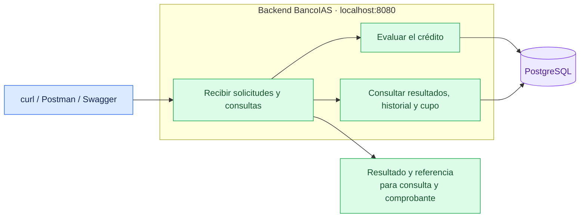
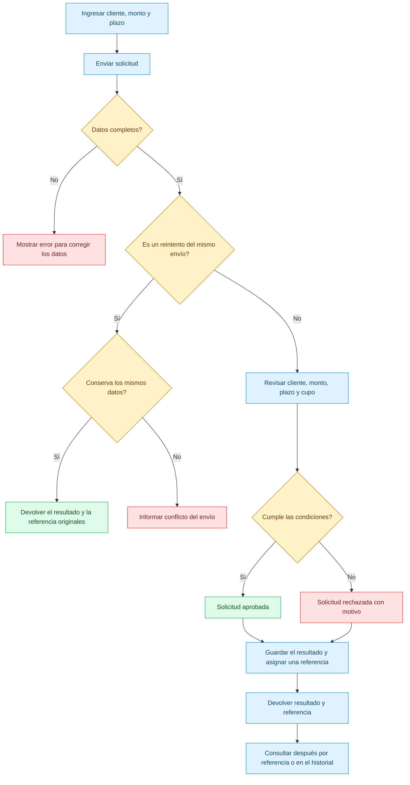

# 🏦 BancoIAS · Sistema de solicitudes de crédito

**Backend para registrar solicitudes de crédito, consultar sus resultados y conocer el cupo disponible de cada cliente.**


## Contenido

- [Qué permite hacer](#qué-permite-hacer)
- [Vista general del sistema](#vista-general-del-sistema)
- [Estructura del proyecto](#estructura-del-proyecto)
- [Flujo de una solicitud](#flujo-de-una-solicitud)
- [Preparar PostgreSQL](#preparar-postgresql)
- [Cómo levantar el backend](#cómo-levantar-el-backend)
- [Cómo probarlo con curl](#cómo-probarlo-con-curl)
- [Cómo probarlo con Swagger](#cómo-probarlo-con-swagger)
- [Cómo probarlo con Postman](#cómo-probarlo-con-postman)
- [Recorrido de demostración](#recorrido-de-demostración)
- [Pruebas automatizadas](#pruebas-automatizadas)
- [Problemas frecuentes](#problemas-frecuentes)

## Qué permite hacer

- Enviar solicitudes indicando cliente, monto y plazo.
- Recibir una aprobación o un rechazo con su motivo.
- Obtener una referencia automática, como `REF-001`, para consultas y comprobantes.
- Buscar una solicitud por su referencia.
- Recorrer el historial de solicitudes por páginas.
- Consultar el cupo total, aprobado y disponible de un cliente.
- Recuperar un envío sin duplicar la solicitud ni consumir cupo otra vez.
- Comprobar si el servicio está disponible.

Para aprobar una solicitud, el cliente debe existir y estar habilitado, el monto debe ser positivo, el plazo debe estar entre **6 y 60 meses**, y el monto solicitado debe caber en su cupo disponible.

Los rechazos también quedan registrados y reciben una referencia. Las solicitudes aprobadas consumen cupo; los rechazos y los reintentos idénticos no lo consumen adicionalmente.

## Vista general del sistema

El backend funciona como un **monolito**: el procesamiento y las consultas se ofrecen desde una misma aplicación.



## Estructura del proyecto

Archivos principales de este repositorio:

```text
back-IAS/
├── README.md
├── CONTEXTO_IA.md
├── Dockerfile
├── .dockerignore
├── build.gradle
├── settings.gradle
├── gradlew
├── gradlew.bat
├── gradle/wrapper/
└── src/
    ├── main/
    │   ├── java/com/backend_IAS/demo/
    │   │   ├── DemoApplication.java
    │   │   ├── domain/
    │   │   ├── application/
    │   │   ├── infrastructure/
    │   │   └── exception/
    │   └── resources/
    │       └── application.properties
    └── test/
        ├── java/
        └── resources/
```

## Flujo de una solicitud



## Preparar PostgreSQL

### Requisitos

- **JDK 21** para ejecutar el backend con Gradle.
- **PostgreSQL 17** instalado localmente, o **Docker Engine / Docker Desktop** iniciado para levantarlo en un contenedor.
- Puertos **5432** y **8080** disponibles.
- **curl o Postman** para probar la API.

Gradle se descarga mediante el wrapper incluido. La primera ejecución puede tardar mientras se descargan las herramientas y dependencias.

### Opción A: PostgreSQL instalado localmente

Instalar PostgreSQL 17 e iniciar su servicio. Abrir una consola SQL con el usuario administrador mediante pgAdmin o `psql`:

```text
psql -h localhost -p 5432 -U postgres -d postgres
```

Continuar con **Crear la base y el usuario de aplicación**.

### Opción B: PostgreSQL en Docker

Los comandos de esta sección utilizan **PowerShell**. Crear una red y un volumen para conservar los datos:

```powershell
docker network create bancoias-local
docker volume create bancoias-pgdata
$env:POSTGRES_PASSWORD = Read-Host "Contraseña del administrador de PostgreSQL"
docker run -d --name bancoias-postgres `
  --network bancoias-local `
  -p 5432:5432 `
  -e POSTGRES_PASSWORD `
  -v bancoias-pgdata:/var/lib/postgresql/data `
  --health-cmd="pg_isready -U postgres" `
  --health-interval=5s --health-timeout=3s --health-retries=10 `
  postgres:17-alpine
```

Comprobar el estado y esperar **`healthy`**:

```powershell
docker ps --filter name=bancoias-postgres
```

Abrir la consola SQL del administrador:

```powershell
docker exec -it bancoias-postgres psql -U postgres -d postgres
```

### Crear la base y el usuario de aplicación

En la consola SQL del administrador, ejecutar estas instrucciones por separado:

```sql
CREATE ROLE credit_app LOGIN;
CREATE DATABASE bancoias OWNER credit_app;
```

En `psql`, asignar la contraseña del usuario de aplicación y salir:

```text
\password credit_app
\q
```

En pgAdmin, asignar esa contraseña desde las propiedades del rol `credit_app`.

Conectarse a **`bancoias` como `credit_app`** para crear las tablas. Con PostgreSQL local:

```text
psql -h localhost -p 5432 -U credit_app -d bancoias
```

Con PostgreSQL en Docker:

```powershell
docker exec -it bancoias-postgres psql -h 127.0.0.1 -U credit_app -d bancoias
```

### Crear el esquema y cargar los clientes de ejemplo

Ejecutar el siguiente SQL **una sola vez en la base vacía**, conectado como `credit_app`. El backend tiene `spring.sql.init.mode=never`, por lo que no crea las tablas al arrancar.

```sql
BEGIN;

CREATE SEQUENCE credit_applications_reference_seq AS BIGINT START WITH 1;

CREATE FUNCTION next_application_reference() RETURNS TEXT
LANGUAGE SQL VOLATILE AS $$
    SELECT 'REF-' || CASE WHEN length(value) < 3 THEN lpad(value, 3, '0') ELSE value END
    FROM (SELECT nextval('credit_applications_reference_seq')::TEXT AS value) sequence_value
$$;

CREATE TABLE customers (
    customer_id TEXT PRIMARY KEY CHECK (btrim(customer_id) <> ''),
    status TEXT NOT NULL CHECK (status IN ('ELIGIBLE', 'BLOCKED')),
    approval_limit NUMERIC NOT NULL CHECK (
        approval_limit >= 0
        AND approval_limit NOT IN ('NaN'::NUMERIC, 'Infinity'::NUMERIC, '-Infinity'::NUMERIC)
    )
);

CREATE TABLE credit_applications (
    id BIGINT GENERATED ALWAYS AS IDENTITY PRIMARY KEY,
    application_reference TEXT NOT NULL DEFAULT next_application_reference()
        CHECK (btrim(application_reference) <> ''),
    idempotency_key TEXT NOT NULL
        CHECK (idempotency_key ~ '^[0-9a-f]{8}-[0-9a-f]{4}-[0-9a-f]{4}-[0-9a-f]{4}-[0-9a-f]{12}$'),
    requested_customer_id TEXT NOT NULL CHECK (btrim(requested_customer_id) <> ''),
    customer_id TEXT,
    amount NUMERIC NOT NULL CHECK (
        amount NOT IN ('NaN'::NUMERIC, 'Infinity'::NUMERIC, '-Infinity'::NUMERIC)
    ),
    term_months INTEGER NOT NULL,
    status TEXT NOT NULL CHECK (status IN ('APPROVED', 'REJECTED')),
    reason_code TEXT,
    reason TEXT,
    processed_at TIMESTAMPTZ NOT NULL DEFAULT clock_timestamp(),
    CONSTRAINT uq_credit_applications_reference UNIQUE (application_reference),
    CONSTRAINT uq_credit_applications_idempotency_key UNIQUE (idempotency_key),
    CONSTRAINT fk_credit_applications_customer FOREIGN KEY (customer_id)
        REFERENCES customers(customer_id) ON DELETE RESTRICT,
    CONSTRAINT ck_credit_applications_decision CHECK (
        (status = 'APPROVED' AND reason_code IS NULL AND reason IS NULL
            AND customer_id IS NOT NULL AND amount > 0 AND term_months BETWEEN 6 AND 60)
        OR (status = 'REJECTED' AND reason_code IS NOT NULL AND reason IS NOT NULL
            AND btrim(reason) <> '' AND reason_code IN (
                'INVALID_AMOUNT', 'INVALID_TERM', 'CUSTOMER_BLOCKED',
                'INSUFFICIENT_LIMIT', 'CUSTOMER_NOT_FOUND'
            ))
    ),
    CONSTRAINT ck_credit_applications_customer CHECK (
        customer_id IS NULL OR customer_id = requested_customer_id
    ),
    CONSTRAINT ck_credit_applications_customer_not_found CHECK (
        reason_code IS DISTINCT FROM 'CUSTOMER_NOT_FOUND' OR customer_id IS NULL
    )
);

CREATE INDEX ix_credit_applications_customer_status ON credit_applications(customer_id, status);
CREATE INDEX ix_credit_applications_recent ON credit_applications(processed_at DESC, id DESC);

INSERT INTO customers (customer_id, status, approval_limit) VALUES
    ('CLI-1001', 'ELIGIBLE', 10000000),
    ('CLI-1002', 'BLOCKED', 8000000),
    ('CLI-2001', 'ELIGIBLE', 15000000);

COMMIT;

SELECT customer_id, status, approval_limit FROM customers ORDER BY customer_id;
```

Se esperan **tres clientes** y ninguna solicitud registrada. En `psql`, salir con `\q`.

La creación de tablas, índices, función y secuencias con `credit_app` deja los permisos necesarios en ese mismo usuario. Si ya existe una base inicializada, utilizar su nombre y usuario al configurar el backend; no volver a ejecutar este bloque sobre sus tablas.

## Cómo levantar el backend

### 1. Configurar la conexión

Desde la raíz de **`back-IAS`**, definir las variables en la misma terminal donde se ejecutará Gradle. Para las dos opciones anteriores, cuando el backend se ejecuta en el equipo local:

```powershell
$env:DB_URL = "r2dbc:postgresql://localhost:5432/bancoias"
$env:DB_USER = "credit_app"
$env:DB_PASSWORD = Read-Host "Contraseña de credit_app"
```

En Linux / macOS, con Bash:

```bash
export DB_URL='r2dbc:postgresql://localhost:5432/bancoias'
export DB_USER='credit_app'
read -r -s -p 'Contraseña de credit_app: ' DB_PASSWORD
export DB_PASSWORD
```

Usar los valores de la base elegida. `application.properties` toma la conexión de `${DB_URL}`, `${DB_USER}` y `${DB_PASSWORD}`. **Spring no carga `.env` automáticamente** con Gradle o el IDE.

### 2. Ejecutar con Gradle o desde el IDE

Windows / PowerShell:

```powershell
.\gradlew.bat bootRun
```

Linux / macOS:

```bash
chmod +x gradlew
./gradlew bootRun
```

Esperar **`Started DemoApplication`** y mantener abierta la terminal. Desde el IDE, configurar las tres variables en la configuración de ejecución y ejecutar `DemoApplication`.

### Alternativa: ejecutar el backend en Docker

Para utilizar **PostgreSQL de la opción B**, mantener `bancoias-postgres` activo en la red `bancoias-local`. Desde la raíz de `back-IAS`, con PowerShell:

```powershell
docker build -t back-ias:local .
$env:DB_URL = "r2dbc:postgresql://bancoias-postgres:5432/bancoias"
$env:DB_USER = "credit_app"
$env:DB_PASSWORD = Read-Host "Contraseña de credit_app"
docker run --rm --name bancoias-backend `
  --network bancoias-local `
  -p 8080:8080 `
  -e DB_URL -e DB_USER -e DB_PASSWORD `
  back-ias:local
```

Dentro del contenedor, la URL usa el nombre del contenedor de PostgreSQL. Si después se ejecuta Gradle en el equipo local, volver a definir `DB_URL` con `localhost`.

### 3. Comprobar la disponibilidad

Desde otra terminal de PowerShell:

```powershell
curl.exe -i "http://localhost:8080/actuator/health"
```

Se espera **HTTP 200** y:

```json
{"status":"UP"}
```

En Linux / macOS, usar `curl` en lugar de `curl.exe`. La comprobación también puede hacerse con un GET en Postman.

### Direcciones de acceso

| Recurso | Dirección |
|---|---|
| API | `http://localhost:8080` |
| Swagger | [http://localhost:8080/swagger-ui.html](http://localhost:8080/swagger-ui.html) |
| Salud del servicio | [http://localhost:8080/actuator/health](http://localhost:8080/actuator/health) |

### Detener y volver a iniciar

Detener Gradle con **Ctrl+C**. Si el backend se ejecutó en Docker, detenerlo desde otra terminal con `docker stop bancoias-backend`.

Para detener PostgreSQL en Docker conservando los datos:

```powershell
docker stop bancoias-postgres
```

Para volver a iniciarlo:

```powershell
docker start bancoias-postgres
```

Esperar `healthy` y ejecutar nuevamente el backend. No hace falta repetir la creación del esquema ni la carga de clientes.

## Cómo probarlo con curl

### Crear una solicitud y repetirla

En **PowerShell**, generar una clave y guardar el cuerpo en un archivo temporal para enviarlo con `curl.exe`:

```powershell
$key = [guid]::NewGuid().ToString()
$requestFile = Join-Path $env:TEMP "bancoias-request.json"
@'
{
  "customerId": "CLI-1001",
  "amount": "1000000.00",
  "termMonths": 12
}
'@ | Set-Content -Path $requestFile -Encoding ascii

curl.exe -i "http://localhost:8080/applications" `
  -H "Content-Type: application/json" `
  -H "Idempotency-Key: $key" `
  --data-binary "@$requestFile"
```

En **Linux / macOS**, con Bash y `uuidgen` disponible:

```bash
key=$(uuidgen)
curl -i 'http://localhost:8080/applications' \
  -H 'Content-Type: application/json' \
  -H "Idempotency-Key: $key" \
  --data-binary '{"customerId":"CLI-1001","amount":"1000000.00","termMonths":12}'
```

Se espera **HTTP 201** y `status: APPROVED` si el cliente tiene cupo suficiente. La respuesta completa se muestra en la sección de Postman.

Repetir el comando `curl` con la **misma clave y cuerpo**: se espera **HTTP 200**, la misma referencia, decisión y fecha, sin consumo adicional. El mensaje indica que la solicitud ya había sido procesada. Para una solicitud nueva, generar otra clave.

### Consultar el resultado, el historial y el cupo

En PowerShell, sustituir `REF-001` por la referencia devuelta:

```powershell
$reference = "REF-001"
curl.exe -i "http://localhost:8080/applications/$reference"
curl.exe -i "http://localhost:8080/applications?page=0&size=2"
curl.exe -i "http://localhost:8080/customers/CLI-1001/credit-summary"
```

En Linux / macOS, usar `curl` y definir `reference='REF-001'`.

Se espera **HTTP 200** en las tres consultas:

- **Referencia:** la solicitud almacenada con su decisión y fecha original.
- **Historial:** un objeto con `content`, `page`, `size`, `totalElements`, `totalPages`, `first` y `last`. `content` contiene las solicitudes de esa página.
- **Cupo:** `customerId`, `status`, `creditLimit`, `approvedAmount` y `availableAmount`.

En una base recién inicializada, después de aprobar únicamente el millón del ejemplo, el resumen de `CLI-1001` indica cupo **10.000.000**, aprobado **1.000.000** y disponible **9.000.000**. Los montos se devuelven como texto decimal.

```json
{
  "customerId": "CLI-1001",
  "status": "ELIGIBLE",
  "creditLimit": "10000000",
  "approvedAmount": "1000000.00",
  "availableAmount": "9000000.00"
}
```

La cantidad de decimales puede variar; los valores representan los mismos montos.

### Comprobar un rechazo y un conflicto

- Cambiar el cliente del cuerpo a `CLI-1002`, generar otra clave y enviar: **201**, `status: REJECTED`, `reasonCode: CUSTOMER_BLOCKED` y un motivo en español.
- Reutilizar una clave ya procesada cambiando el monto: **409**, `code: IDEMPOTENCY_CONFLICT`.
- Omitir `Idempotency-Key`: **400**. Los errores contienen `code`, `message` y `traceId`; la cabecera `X-Trace-Id` coincide con ese identificador.

## Cómo probarlo con Swagger

Swagger permite explorar y ejecutar las operaciones desde el navegador. Se inicia junto con el backend.

### Abrir y enviar una solicitud

1. Abrir **[http://localhost:8080/swagger-ui.html](http://localhost:8080/swagger-ui.html)**.
2. Dentro de **Applications**, expandir **POST `/applications`**.
3. Seleccionar **Try it out**.
4. Completar **`Idempotency-Key`** con un UUID, por ejemplo:

   ```text
   83b36c7f-6a2f-466a-8581-d9ac7f655038
   ```

5. En **Request body**, utilizar:

   ```json
   {
     "customerId": "CLI-1001",
     "amount": "1000000.00",
     "termMonths": 12
   }
   ```

6. Pulsar **Execute**.
7. Revisar **Server response** y conservar la referencia recibida para consultar la solicitud.

Para una solicitud nueva, utilizar una clave nueva. Se puede obtener una en PowerShell con:

```powershell
[guid]::NewGuid().ToString()
```

**Conservar la misma clave y los mismos datos al reintentar un envío.** La referencia, en cambio, la devuelve el sistema; no se introduce en el cuerpo del POST.

Un envío desde Swagger registra una solicitud real. Si se aprueba, consume cupo.

### Qué resultado esperar

| Situación | Resultado |
|---|---|
| Solicitud nueva | **201**, con referencia automática y resultado aprobado o rechazado. |
| Repetir la misma clave y los mismos datos | **200**, con el resultado original y sin consumo adicional. |
| Cambiar los datos conservando una clave utilizada | **409**, indicando conflicto. |
| Datos incompletos o clave ausente/inválida | **400**, con un mensaje para corregir el envío. |

Una aprobación tiene `status: APPROVED`. Un rechazo tiene `status: REJECTED` y explica el motivo. Ambos pueden devolver **201**, porque ambos quedan registrados.

### Consultar resultados

Para cada GET, seleccionar **Try it out**, completar los campos y pulsar **Execute**:

| Operación | Datos de ejemplo | Qué permite ver |
|---|---|---|
| GET `/applications/{reference}` | La referencia recibida, por ejemplo `REF-001`. | Resultado de una solicitud concreta. |
| GET `/applications` | `page=0`, `size=2`. | Primera página del historial y sus totales. |
| GET `/applications` | `page=1`, `size=2`. | Segunda página del historial. |
| GET `/customers/{customerId}/credit-summary` | `customerId=CLI-1001`. | Cupo total, aprobado y disponible. |
| GET `/actuator/health` | Sin parámetros. | Disponibilidad del servicio. |

Las páginas comienzan en **cero**. El tamaño predeterminado es **20** y admite valores entre **1 y 100**. Una página fuera del rango devuelve **200**, `content: []` y los totales reales. Se ordenan las solicitudes de la más reciente a la más antigua. El parámetro `limit` no se admite y devuelve **400**. La búsqueda por referencia consulta todo el historial.

## Cómo probarlo con Postman

Usar la dirección **`http://localhost:8080`** para llamar directamente al backend.

### Crear una solicitud

Seleccionar **POST** y utilizar:

```text
http://localhost:8080/applications
```

En **Headers**:

| Key | Value |
|---|---|
| `Content-Type` | `application/json` |
| `Idempotency-Key` | `83b36c7f-6a2f-466a-8581-d9ac7f655038` |

En **Body → raw → JSON**:

```json
{
  "customerId": "CLI-1001",
  "amount": "1000000.00",
  "termMonths": 12
}
```

Pulsar **Send**. Con una clave nueva, se obtiene HTTP 201 y una respuesta como esta, si el cliente conserva cupo suficiente:

```json
{
  "applicationReference": "REF-001",
  "customerId": "CLI-1001",
  "amount": "1000000.00",
  "termMonths": 12,
  "status": "APPROVED",
  "message": "Esta solicitud fue aprobada",
  "processedAt": "2026-10-01T12:00:00Z",
  "reasonCode": null,
  "reason": null
}
```

La referencia y la fecha son ejemplos; utilizar los valores devueltos en el envío real.

### Consultar una solicitud, el historial y el cupo

Crear peticiones **GET**, sin cuerpo:

```http
GET http://localhost:8080/applications/REF-001
GET http://localhost:8080/applications?page=0&size=2
GET http://localhost:8080/customers/CLI-1001/credit-summary
```

Sustituir `REF-001` por la referencia recibida. Para comprobar un reintento, repetir el POST conservando su clave y cuerpo: debe devolver HTTP 200 y la misma referencia.

También se pueden importar las operaciones en Postman mediante **Import**, usando `http://localhost:8080/v3/api-docs` con el backend iniciado.

## Recorrido de demostración

### Clientes de ejemplo

Estos son los clientes de una base recién inicializada:

| Cliente | Estado | Cupo |
|---|---|---:|
| `CLI-1001` | Habilitado | 10.000.000 |
| `CLI-1002` | Bloqueado | 8.000.000 |
| `CLI-2001` | Habilitado | 15.000.000 |

### Escenarios para presentar

| Escenario | Cómo probarlo | Resultado esperado |
|---|---|---|
| Aprobación | Cliente habilitado, monto positivo dentro del cupo y plazo de 12 meses. | Aprobación con referencia automática. |
| Cliente bloqueado | `CLI-1002`, monto `1000` y plazo `12`. | Rechazo con motivo `CUSTOMER_BLOCKED`. |
| Cliente inexistente | `CLI-MISSING`, monto `1000` y plazo `12`. | Rechazo con motivo `CUSTOMER_NOT_FOUND`. |
| Monto inválido | `CLI-1001`, monto `0` y plazo `12`. | Rechazo con motivo `INVALID_AMOUNT`. |
| Plazo inválido | `CLI-1001`, monto `1000` y plazo `5`. | Rechazo con motivo `INVALID_TERM`. |
| Cupo insuficiente | Solicitar más que el saldo disponible de un cliente habilitado. | Rechazo con motivo `INSUFFICIENT_LIMIT`. |
| Reintento | Repetir una solicitud con la misma clave y datos. | Mismo resultado y referencia, sin duplicar el consumo. |
| Conflicto | Reutilizar una clave cambiando cliente, monto o plazo. | HTTP 409. |
| Consulta e historial | Buscar una referencia y recorrer varias páginas. | Resultados previamente registrados. |

Usar **una clave nueva para cada solicitud nueva** de la demostración.

### Demostrar el consumo parcial de cupo

Partiendo de `CLI-1001` con su cupo inicial de 10 millones y sin aprobaciones previas:

1. Consultar su resumen: disponible **10 millones**.
2. Enviar una solicitud nueva de **6 millones**, a 12 meses: aprobada.
3. Consultar el resumen: disponible **4 millones**.
4. Repetir el mismo envío con su misma clave: el disponible sigue en **4 millones**.
5. Enviar una solicitud nueva de **5 millones**: rechazada por cupo insuficiente.
6. Enviar una solicitud nueva de **4 millones**: aprobada y disponible **cero**.

El resultado depende del estado inicial indicado. Las solicitudes anteriores de otras pruebas pueden haber consumido parte del cupo.

## Pruebas automatizadas

Con Docker iniciado, ejecutar desde la raíz de `back-IAS`:

```powershell
.\gradlew.bat test
```

En Linux / macOS:

```bash
./gradlew test
```

La última suite completa aprobó **229 pruebas**, sin fallos ni pruebas omitidas. Comprueban aprobaciones, rechazos, referencias automáticas, reintentos, cupo, consultas y paginación, entre otros escenarios.

Después de ejecutar la suite, abrir el reporte en:

```text
build/reports/tests/test/index.html
```

## Problemas frecuentes

| Situación | Qué hacer |
|---|---|
| No abre Swagger o la API. | Confirmar que el backend siga activo y haya terminado de arrancar. |
| El puerto 8080 está ocupado. | Detener la otra instancia o usar `.\gradlew.bat bootRun --args="--server.port=8081"` y cambiar el puerto en las URLs de prueba. |
| Swagger no carga las operaciones. | Abrir `http://localhost:8080/v3/api-docs`, revisar los mensajes de la terminal y recargar la página. |
| POST devuelve 400. | Revisar los tres campos y completar `Idempotency-Key` con un UUID válido. |
| POST devuelve 409. | Recuperar el envío con sus datos originales o usar otra clave para una solicitud nueva. |
| POST devuelve 429. | Esperar los segundos de `Retry-After` y repetir con la misma clave y datos. |
| Una consulta por referencia devuelve 404. | Copiar la referencia exacta recibida al procesar la solicitud. |
| El servicio indica `DOWN` o una operación no puede completarse. | Comprobar que PostgreSQL esté activo, que la conexión apunte a la base elegida y que se haya creado el esquema. |
| No se resuelven `DB_URL`, `DB_USER` o `DB_PASSWORD`. | Definir las variables en la misma terminal que ejecuta Gradle o en la configuración del IDE. Un `.env` por sí solo no se carga en esas ejecuciones. |
| PostgreSQL devuelve un error de autenticación. | Utilizar el usuario y la contraseña asignados al crear el rol de aplicación. |
| Aparece `relation does not exist` o falta una secuencia. | Crear el esquema completo en la base indicada por `DB_URL`, conectado con el usuario de aplicación. |
| Una operación devuelve 503 con `DATABASE_TIMEOUT`. | Comprobar conectividad, disponibilidad y bloqueos de PostgreSQL antes de reintentar con la misma clave y cuerpo. |
| Se pierde la respuesta de un envío. | Repetir con la misma clave y los mismos datos para recuperar su resultado. |

## Uso de IA

Consultar [USO_IA.md](USO_IA.md) para conocer el apoyo de la IA durante el desarrollo, las sugerencias aceptadas y las correcciones realizadas.
