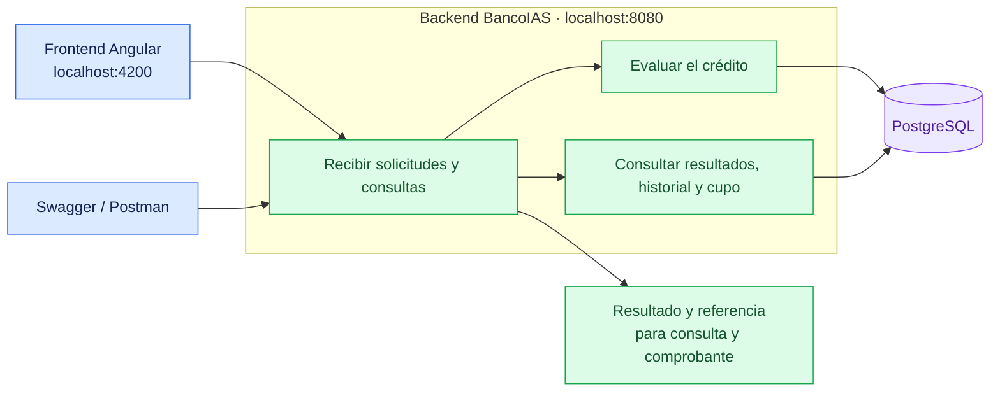

# 🏦 BancoIAS · Sistema de solicitudes de crédito

**Backend para registrar solicitudes de crédito, consultar sus resultados y conocer el cupo disponible de cada cliente.**


## Contenido

- [Qué permite hacer](#qué-permite-hacer)
- [Vista general del sistema](#vista-general-del-sistema)
- [Estructura del proyecto](#estructura-del-proyecto)
- [Flujo de una solicitud](#flujo-de-una-solicitud)
- [Cómo levantar el sistema](#cómo-levantar-el-sistema)
- [Cómo probarlo con Swagger](#cómo-probarlo-con-swagger)
- [Cómo probarlo con Postman](#cómo-probarlo-con-postman)
- [Recorrido de demostración](#recorrido-de-demostración)
- [Pruebas automatizadas](#pruebas-automatizadas)
- [Problemas frecuentes](#problemas-frecuentes)
- [Documentación complementaria](#documentación-complementaria)

## Qué permite hacer

- Enviar solicitudes indicando cliente, monto y plazo.
- Recibir una aprobación o un rechazo con su motivo.
- Obtener una referencia automática, como `REF-001`, para consultas y comprobantes.
- Buscar una solicitud por su referencia.
- Recorrer el historial de solicitudes por páginas.
- Consultar el cupo total, aprobado y disponible de un cliente.
- Recuperar un envío sin duplicar la solicitud ni consumir cupo otra vez.
- Comprobar si el servicio está disponible.

Para aprobar una solicitud, el cliente debe existir y estar habilitado, el monto debe ser positivo, el plazo debe estar entre **6 y 60 meses**, y el monto solicitado debe caber en su cupo disponible.

Los rechazos también quedan registrados y reciben una referencia. Las solicitudes aprobadas consumen cupo; los rechazos y los reintentos idénticos no lo consumen adicionalmente.

## Vista general del sistema

El backend funciona como un **monolito**: el procesamiento y las consultas se ofrecen desde una misma aplicación.



## Estructura del proyecto

Los tres proyectos se ubican en directorios hermanos:

```text
proyectos/
├── back-IAS/                         # Backend y pruebas
│   ├── README.md
│   ├── CONTEXTO_IA.md
│   ├── Dockerfile
│   ├── .dockerignore
│   ├── build.gradle
│   ├── settings.gradle
│   ├── gradlew
│   ├── gradlew.bat
│   ├── gradle/wrapper/
│   └── src/
│       ├── main/
│       │   ├── java/com/backend_IAS/demo/
│       │   │   ├── DemoApplication.java
│       │   │   ├── domain/
│       │   │   ├── application/
│       │   │   ├── infrastructure/
│       │   │   └── exception/
│       │   └── resources/
│       │       └── application.properties
│       └── test/
│           ├── java/
│           └── resources/
├── compose-sistema-IAS/              # Entorno local de PostgreSQL
│   ├── compose.yaml
│   └── db/init/
└── front-IAS/                        # Interfaz de usuario Angular
    ├── README.md
    ├── package.json
    ├── proxy.conf.cjs
    └── src/
```

## Flujo de una solicitud


## Cómo levantar el sistema

### Requisitos

- **JDK 21**.
- **Docker Engine o Docker Desktop** iniciado, con Docker Compose disponible.
- Proyectos `back-IAS` y `compose-sistema-IAS` en directorios hermanos.
- Puertos **5432** y **8080** disponibles.
- Para utilizar la interfaz: proyecto `front-IAS`, **Node.js 24 LTS** compatible con sus requisitos, **npm 11** y puerto **4200** disponible.

Gradle se descarga mediante el wrapper incluido. La primera ejecución puede tardar mientras se descargan las herramientas y dependencias.

### 1. Iniciar la base de datos

Desde la raíz de **`back-IAS`**:

```powershell
docker compose --env-file ../compose-sistema-IAS/.env -f ../compose-sistema-IAS/compose.yaml up -d --wait postgres
```

Para comprobar su estado:

```powershell
docker compose --env-file ../compose-sistema-IAS/.env -f ../compose-sistema-IAS/compose.yaml ps postgres
```

El entorno de base de datos debe estar inicializado con los scripts actuales de `compose-sistema-IAS/db/init`. Reiniciar una base anterior conserva sus datos y no aplica automáticamente los cambios de esos scripts.

### 2. Iniciar el backend

Desde la raíz de **`back-IAS`**, en Windows / PowerShell:

```powershell
.\gradlew.bat bootRun
```

En Linux / macOS:

```bash
chmod +x gradlew
./gradlew bootRun
```

Esperar el mensaje **`Started DemoApplication`** y mantener abierta la terminal.

También se puede iniciar desde el IDE ejecutando `DemoApplication`.

### 3. Comprobar la disponibilidad

Abrir en el navegador o enviar un GET desde Postman:

```text
http://localhost:8080/actuator/health
```

Un servicio disponible devuelve **HTTP 200** y `status: UP`.

En PowerShell también se puede comprobar con:

```powershell
Invoke-RestMethod -Uri "http://localhost:8080/actuator/health"
```

### 4. Iniciar la interfaz de usuario

Desde la raíz de **`front-IAS`**, en otra terminal:

```powershell
npm ci
npm start
```

Abrir **[http://localhost:4200](http://localhost:4200)**. Mantener activos PostgreSQL y el backend para utilizar los envíos y las consultas.

### Direcciones de acceso

| Recurso | Dirección |
|---|---|
| Interfaz de usuario | [http://localhost:4200](http://localhost:4200) |
| API | `http://localhost:8080` |
| Swagger | [http://localhost:8080/swagger-ui.html](http://localhost:8080/swagger-ui.html) |
| Salud del servicio | [http://localhost:8080/actuator/health](http://localhost:8080/actuator/health) |

### Detener el sistema

Pulsar **Ctrl+C** en las terminales del frontend y del backend. Para detener PostgreSQL conservando los datos, ejecutar desde `back-IAS`:

```powershell
docker compose --env-file ../compose-sistema-IAS/.env -f ../compose-sistema-IAS/compose.yaml stop postgres
```

## Cómo probarlo con Swagger

Swagger permite explorar y ejecutar las operaciones desde el navegador. Se inicia junto con el backend y puede utilizarse directamente, sin abrir la interfaz Angular.

### Abrir y enviar una solicitud

1. Abrir **[http://localhost:8080/swagger-ui.html](http://localhost:8080/swagger-ui.html)**.
2. Dentro de **Applications**, expandir **POST `/applications`**.
3. Seleccionar **Try it out**.
4. Completar **`Idempotency-Key`** con un UUID, por ejemplo:

   ```text
   83b36c7f-6a2f-466a-8581-d9ac7f655038
   ```

5. En **Request body**, utilizar:

   ```json
   {
     "customerId": "CLI-1001",
     "amount": "1000000.00",
     "termMonths": 12
   }
   ```

6. Pulsar **Execute**.
7. Revisar **Server response** y conservar la referencia recibida para consultar la solicitud.

Para una solicitud nueva, utilizar una clave nueva. Se puede obtener una en PowerShell con:

```powershell
[guid]::NewGuid().ToString()
```

**Conservar la misma clave y los mismos datos al reintentar un envío.** La referencia, en cambio, la devuelve el sistema; no se introduce en el cuerpo del POST.

Un envío desde Swagger registra una solicitud real. Si se aprueba, consume cupo.

### Qué resultado esperar

| Situación | Resultado |
|---|---|
| Solicitud nueva | **201**, con referencia automática y resultado aprobado o rechazado. |
| Repetir la misma clave y los mismos datos | **200**, con el resultado original y sin consumo adicional. |
| Cambiar los datos conservando una clave utilizada | **409**, indicando conflicto. |
| Datos incompletos o clave ausente/inválida | **400**, con un mensaje para corregir el envío. |

Una aprobación tiene `status: APPROVED`. Un rechazo tiene `status: REJECTED` y explica el motivo. Ambos pueden devolver **201**, porque ambos quedan registrados.

### Consultar resultados

Para cada GET, seleccionar **Try it out**, completar los campos y pulsar **Execute**:

| Operación | Datos de ejemplo | Qué permite ver |
|---|---|---|
| GET `/applications/{reference}` | La referencia recibida, por ejemplo `REF-001`. | Resultado de una solicitud concreta. |
| GET `/applications` | `page=0`, `size=2`. | Primera página del historial y sus totales. |
| GET `/applications` | `page=1`, `size=2`. | Segunda página del historial. |
| GET `/customers/{customerId}/credit-summary` | `customerId=CLI-1001`. | Cupo total, aprobado y disponible. |
| GET `/actuator/health` | Sin parámetros. | Disponibilidad del servicio. |

Las páginas comienzan en **cero**. El tamaño predeterminado es **20** y admite valores entre **1 y 100**. Una página sin resultados devuelve contenido vacío. La búsqueda por referencia consulta todo el historial, no solo la página abierta.

## Cómo probarlo con Postman

Usar la dirección **`http://localhost:8080`** para llamar directamente al backend.

### Crear una solicitud

Seleccionar **POST** y utilizar:

```text
http://localhost:8080/applications
```

En **Headers**:

| Key | Value |
|---|---|
| `Content-Type` | `application/json` |
| `Idempotency-Key` | `83b36c7f-6a2f-466a-8581-d9ac7f655038` |

En **Body → raw → JSON**:

```json
{
  "customerId": "CLI-1001",
  "amount": "1000000.00",
  "termMonths": 12
}
```

Pulsar **Send**. Con una clave nueva, se obtiene HTTP 201 y una respuesta como esta, si el cliente conserva cupo suficiente:

```json
{
  "applicationReference": "REF-001",
  "customerId": "CLI-1001",
  "amount": "1000000.00",
  "termMonths": 12,
  "status": "APPROVED",
  "message": "Esta solicitud fue aprobada",
  "processedAt": "2026-10-01T12:00:00Z",
  "reasonCode": null,
  "reason": null
}
```

La referencia y la fecha son ejemplos; utilizar los valores devueltos en el envío real.

### Consultar una solicitud, el historial y el cupo

Crear peticiones **GET**, sin cuerpo:

```http
GET http://localhost:8080/applications/REF-001
GET http://localhost:8080/applications?page=0&size=2
GET http://localhost:8080/customers/CLI-1001/credit-summary
```

Sustituir `REF-001` por la referencia recibida. Para comprobar un reintento, repetir el POST conservando su clave y cuerpo: debe devolver HTTP 200 y la misma referencia.

También se pueden importar las operaciones en Postman mediante **Import**, usando `http://localhost:8080/v3/api-docs` con el backend iniciado.

## Recorrido de demostración

### Clientes de ejemplo

Estos son los clientes de una base recién inicializada:

| Cliente | Estado | Cupo |
|---|---|---:|
| `CLI-1001` | Habilitado | 10.000.000 |
| `CLI-1002` | Bloqueado | 8.000.000 |
| `CLI-2001` | Habilitado | 15.000.000 |

### Escenarios para presentar

| Escenario | Cómo probarlo | Resultado esperado |
|---|---|---|
| Aprobación | Cliente habilitado, monto positivo dentro del cupo y plazo de 12 meses. | Aprobación con referencia automática. |
| Cliente bloqueado | `CLI-1002`, monto `1000` y plazo `12`. | Rechazo con motivo `CUSTOMER_BLOCKED`. |
| Cliente inexistente | `CLI-MISSING`, monto `1000` y plazo `12`. | Rechazo con motivo `CUSTOMER_NOT_FOUND`. |
| Monto inválido | `CLI-1001`, monto `0` y plazo `12`. | Rechazo con motivo `INVALID_AMOUNT`. |
| Plazo inválido | `CLI-1001`, monto `1000` y plazo `5`. | Rechazo con motivo `INVALID_TERM`. |
| Cupo insuficiente | Solicitar más que el saldo disponible de un cliente habilitado. | Rechazo con motivo `INSUFFICIENT_LIMIT`. |
| Reintento | Repetir una solicitud con la misma clave y datos. | Mismo resultado y referencia, sin duplicar el consumo. |
| Conflicto | Reutilizar una clave cambiando cliente, monto o plazo. | HTTP 409. |
| Consulta e historial | Buscar una referencia y recorrer varias páginas. | Resultados previamente registrados. |

Usar **una clave nueva para cada solicitud nueva** de la demostración.

### Demostrar el consumo parcial de cupo

Partiendo de `CLI-1001` con su cupo inicial de 10 millones y sin aprobaciones previas:

1. Consultar su resumen: disponible **10 millones**.
2. Enviar una solicitud nueva de **6 millones**, a 12 meses: aprobada.
3. Consultar el resumen: disponible **4 millones**.
4. Repetir el mismo envío con su misma clave: el disponible sigue en **4 millones**.
5. Enviar una solicitud nueva de **5 millones**: rechazada por cupo insuficiente.
6. Enviar una solicitud nueva de **4 millones**: aprobada y disponible **cero**.

El resultado depende del estado inicial indicado. Las solicitudes anteriores de otras pruebas pueden haber consumido parte del cupo.

## Pruebas automatizadas

Con Docker iniciado, ejecutar desde la raíz de `back-IAS`:

```powershell
.\gradlew.bat test
```

En Linux / macOS:

```bash
./gradlew test
```

La última suite completa aprobó **229 pruebas**, sin fallos ni pruebas omitidas. Comprueban aprobaciones, rechazos, referencias automáticas, reintentos, cupo, consultas y paginación, entre otros escenarios.

Después de ejecutar la suite, abrir el reporte en:

```text
build/reports/tests/test/index.html
```

## Problemas frecuentes

| Situación | Qué hacer |
|---|---|
| No abre Swagger o la API. | Confirmar que el backend siga activo y haya terminado de arrancar. |
| El puerto 8080 está ocupado. | Detener la otra instancia o usar `.\gradlew.bat bootRun --args="--server.port=8081"` y cambiar el puerto en las URLs de Swagger y Postman. La interfaz local utiliza 8080. |
| Swagger no carga las operaciones. | Abrir `http://localhost:8080/v3/api-docs`, revisar los mensajes de la terminal y recargar la página. |
| POST devuelve 400. | Revisar los tres campos y completar `Idempotency-Key` con un UUID válido. |
| POST devuelve 409. | Recuperar el envío con sus datos originales o usar otra clave para una solicitud nueva. |
| POST devuelve 429. | Esperar los segundos de `Retry-After` y repetir con la misma clave y datos. |
| Una consulta por referencia devuelve 404. | Copiar la referencia exacta recibida al procesar la solicitud. |
| El servicio indica `DOWN` o una operación no puede completarse. | Comprobar que PostgreSQL esté activo y que el entorno esté inicializado con los scripts actuales. |
| Se pierde la respuesta de un envío. | Repetir con la misma clave y los mismos datos para recuperar su resultado. |

## Documentación complementaria

- [CONTEXTO_IA.md](CONTEXTO_IA.md): decisiones y verificaciones del proyecto.
- `../front-IAS/README.md`: presentación y ejecución de la interfaz.
- `../front-IAS/REFERENCIAS_AUTOMATICAS.md`: uso de referencias y recuperación de envíos.
- `../front-IAS/PAGINACION_SOLICITUDES.md`: consulta del historial por páginas.
- `../front-IAS/RESUMEN_CUPO_Y_RESILIENCIA.md`: resumen de cupo y tratamiento de errores de operación.
